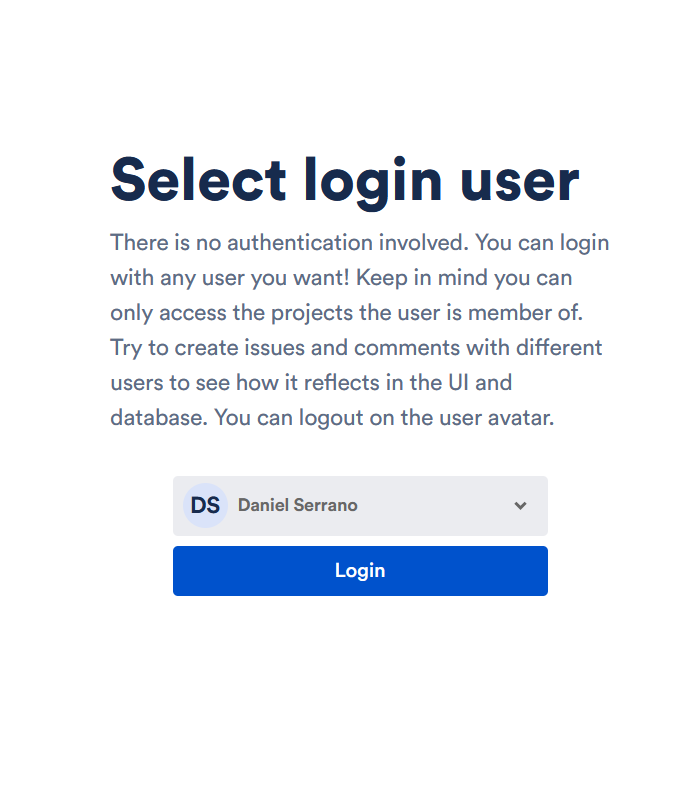
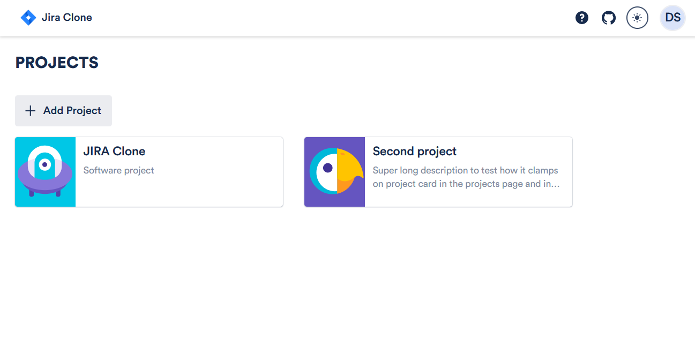
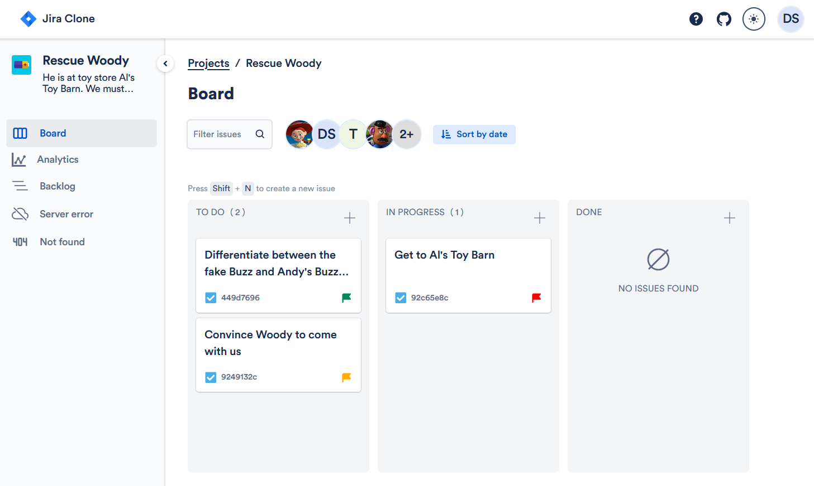

# Jira clone v2.0

A simplified Jira clone application with some custom modifications made with Remix Run. This is a personal project for practicing skills and it is not intended to work as a real Jira application. It is still in early development and some features and improves are coming.

For pragmatic purposes, many features are not included. Others have been modified according to my tastes. The application should serve the basic functionalities of a project management software. I have taken inspiration from the actual [Jira website](https://www.atlassian.com/es/software/jira), as well as from [Trello](https://trello.com/). Also, [Ivor's Jira clone](https://github.com/oldboyxx/jira_clone) has been a great inspiration for me (I have to admit I like his designs more than Jira's originals). I only took ideas and resources (fonts and icons) from the original projects, all developments have being from scratch and by myself.

[LIVE DEMO](https://jira-clone.fly.dev)

## Table of Contents

1. [Setup](#setup)
   - [Install](#install)
   - [Run](#run)
   - [Build](#build)
   - [Test](#test)
2. [Overview](#overview)
   - [Login](#login)
   - [Projects list](#projects-list)
   - [Project space](#project-space)
3. [Project structure](#project_structure)
   - [Domain](#domain)
   - [Infrastructure](#infrastructure)
   - [UI](#ui)
4. [Conventions](#conventions)
5. [Technologies](#technologies)
6. [Goals](#goals)

## Setup<a name="overview"></a>

### Install<a name="install"></a>

The app setup is as simple as any other Remix Run project. First, clone the repository on your local folder.

```
git clone https://github.com/daniserrano7/jira-clone.git
```

After that, navigate to the folder and install the dependencies

```
cd jira-clone
npm install
```

The application needs a database to work. You must first define the SQLite database url via environment variable. The repo provides a template named .sample.env with the structure of your env vars. You can then create your own .env file with the required values. Finally, you can create the database with Prisma by executing the following command:

```
npx prisma db push
```

It will be created in the path specified by the environmental variable DATABASE_URL. To populate the database with some initial data, execute the following command:

```
npx prisma db seed
```

### Run<a name="run"></a>

To run the application in dev mode, execute the following command:

```
npm run dev
```

This project uses Tailwind CSS, so this command will concurrently run the Tailwind CSS compiler in watch mode.

### Build<a name="build"></a>

To build a compiled version of the application, execute the following command:

```
npm run build
```

This command will also execute the Tailwind CSS compiler in production mode. To start the compiled version, execute the following command:

```
npm run start
```

### Test<a name="test"></a>

To execute the test, execute the following command:

```
npm run test
```

Alternatively, you can run ESLint linter, Typescript type checks and Vitest tests all at once with the following command:

```
npm run test-all
```

## Overview<a name="overview"></a>

The app simulates Jira's workspace, where you can create projects, assign users and create and update issues. It uses a SQLite database to store the data, which can be stored locally on your environment (in the live demo it is placed in the Fly's persistent storage). The content is rendered server-side thanks to Remix Run framework, and it barely uses client stores (only for session data and issues search).

It is divided in three main sections: login, projects list and project space.

### Login<a name="login"></a>

The login section is the first one you will see when you open the app. It is a simple select element where you can choose which user you will use to log in. It then creates a cookie session that will be used to authenticate the user at server level in the other sections; otherwise, you will be redirected to the login URL. Once logged in, you can log out by clicking the logout button through the avatar, in the top right corner of the app. This will delete the cookie session and redirect you to the login page.



### Projects list<a name="projects-list"></a>

This sections whows the projects the logged in user has access to. It is possible to create a new project and assign users to it.




### Project space<a name="project-space"></a>

This is the main section of the app. It shows the project's board, where you can see the issues of the project. It also shows other tabs, such as analytics (which is not implemented yet) and backlog (this will never be implemented; it is only shown for UI puposes). There are also links that trigger page errors to show Remix error handling. There are both 404 and 500 errors.

Related to that project board, you can create, edit and delete issues. You can modify issue's properties, change its category, add comments and assign it to different users. Also, it is possible to move an issue from one category to another by drag and drop. Every issue change is streamed to the server thanks to Server Sent Events, so the board is updated in real time (try it with two different tabs!).



Within the issue editing panel you can manage the issue and see its information. It is very intuitive and simple to use, and includes server-side validation. You may notice what, although it is in a different URL route, it is rendered as a modal, including a nice transition.


## Technologies<a name="technologies"></a>

The app is made with [React](https://reactjs.org/) (using ES6 and hooks), [Typescript](https://www.typescriptlang.org/), [Remix Run](https://remix.run/) as a SSR framework, [Radix](https://www.radix-ui.com/) for accesible UI components and [Tailwind CSS](https://tailwindcss.com/) for the styling. Thanks to Remix and its SSR paradigm, state management is reduced at its minimum. Regarding data storage, I've used a [SQLite](https://www.sqlite.org) database, which uses a single file. Depending on the environment, persistent storage is handled differently. Database location URL can be set via environment variables. To handle the database I've used [Prisma](https://www.prisma.io/), which is a great ORM for SQLite. For testing, I've used [Vitest](https://vitest.dev/), but due to the new entities approach I no longer need to test the domain level. I'm planning to test routing and HTTP requests in the future.

I've used [ESLint](https://eslint.org/) for linting with low restrictive rules. For the formatting, I've relied on [Prettier](https://prettier.io/). The app is deployed at [Fly](https://fly.io/).

## Project structure<a name="project_structure"></a>

Following [Clean Architecture's concepts](https://blog.cleancoder.com/uncle-bob/2012/08/13/the-clean-architecture.html), the project's source folder is divided in three sections: domain, infrastructure and ui/app. On the route folder we can find the public folder which includes static assets such as images, fonts and build files.

### Domain<a name="domain"></a>

In the domain folder we can find all entities and value objects related with the project. The entities are mainly modeled by Typescript interfaces. At every entity folder we may find the following files:

- [ENTITY].ts -> the main file including interfaces, value objects and factory function.
- [ENTITY].mock.ts -> mocking entities used for seeding and as initial values to use as examples.
- index.ts -> exports all the other files.

This way, the cohesion between the entities is maximized: they only depends on themselves and, usually, on lower order entities. The hierarchy is the following:

```
users
projects
└───categories
    └───issues
        └───user
        └───comments
            └───user
```

> **NOTE**: Here is represented just the relationships between entities - non-relevant attributes have been omited.

### Infrastructure<a name="infrastructure"></a>

By infrastructure I mean those pieces of the application that are not part of the UI, but serves as a logic support. Those are not framework-related, just like entities. Here we find db, but in the future it may serve for other things e.g. localhost.

Cookie session are not in this sections because they are framework-related to Remix. Store logic and components are also located in the app folder because how closed they are to the implementation.

### APP<a name="app"></a>

Everything related to the Remix application, including the UI and the backend. The folder structure is the following:

- Components -> Shared components accross all the Reacts elements. Usually they are small and generic components.
- Routes -> Remix route folder. It includes the routes and the SSR logic to handle them.
- Session-storage -> Cookie session logic, related to both user authentication and theme.
- Store -> Context API stores to handle easily share user and theme sessions data.
- Styles -> Tailwind CSS global styles and fonts specifications.
- UI -> Hierachical structure of the views. The folder organization matches the UI composition so it can be easier to find a specific file or to get an idea of the UI organization. It intends to follow Robert Martin's [Screaming Architecture](http://blog.cleancoder.com/uncle-bob/2011/09/30/Screaming-Architecture.html) concept.

## Conventions<a name="conventions"></a>

For folder and files naming, I have chosen [Kebab Case](https://en.wiktionary.org/wiki/kebab_case) - I think it improves readability.

> **_E.g._** issue-card

For react components, on the other hand, I prefer the standard [Pascal Case](https://en.wiktionary.org/wiki/Pascal_case#English).

> **_E.g._** IssueCard
>
> Regarding interfaces, it depend on the context. In general, I tend to use the same name they are refered to using Pascal Case.
> **_E.g._** categoryId -> CategoryId

In the case of componentes, to avoid using the same name I add the suffix "Props" to refere to that component's props.

> **_E.g._** IssueCard -> IssueCardProps

## Goals<a name="goals"></a>

All my personal projects have a goal - something to practice. It can be a framework, a styling library or a programming concept. In this one, I tried to put in practice some Clean Architecture concepts, but limited to my understanding and the scope of the project. I did dome entity modeling and created boundaries between domain, infrastructure and ui/application. The goal was to follow the dependency rule and isolate the core parts (domain) from those with lower hierarchy. That is why I chose a Jira clone, in order to have a more or less complex domain to model.

As the development of the application progressed, I also wanted to try the use of Tailwind CSS as styling library and a Server-Side Rendering paradigm. I opted for Remix because I already had experience with Next.js and I liked it's focus on web standards approach.
