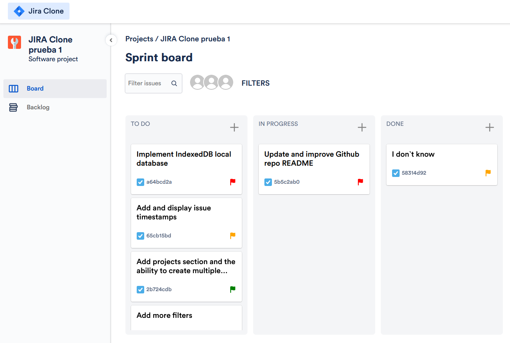
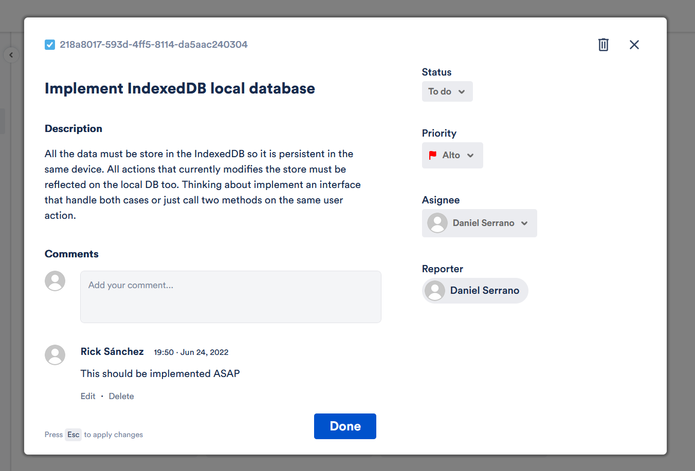

# Jira frontend clone

A simplified Jira clone application with some custom modifications. This is a personal project for practicing skills and it is not intended to work as a real Jira application. It only includes the frontend - all the data lives only in runtime until IndexedDB storage is implemented. It is still in early development and a lot of features and improves are coming.

For pragmatic purposes, many features are not included. Others have been modified according to my tastes. The application should serve the basic functionalities of a project management software. I have take inspiration from the actual [Jira website](https://www.atlassian.com/es/software/jira), as well as from [Trello](https://trello.com/). Also, [Ivor's Jira clone](https://github.com/oldboyxx/jira_clone) has been a great inspiration for me (I have to admit I like his designs more than Jira's originals). I only took inspiration and resources (fonts and icons) from the original projects; I've developed everything from scratch and by myself.

[LIVE DEMO](https://gleaming-sable-407787.netlify.app/)

## Table of Contents
1. [Setup](#setup)
    - [Install](#install)
    - [Run](#run)
    - [Build](#build)
    - [Test](#test)
3. [Overview](#overview)
4. [Project structure](#project_structure)
    - [Domain](#domain)
    - [Infrastructure](#infrastructure)
    - [UI](#ui)
5. [Conventions](#conventions)
6. [Technologies](#technologies)
7. [Goals](#goals)

## Setup<a name="overview"></a>
### Install<a name="install"></a>
The app setup is as simple as any other NPM project. First, clone the repository on your local folder. 

```
git clone https://github.com/daniserrano7/jira-clone.git
```
After that, navigate to the folder and install the dependencies
```
cd jira-clone
npm install
```
### Run<a name="run"></a>
To run the application, execute the following command:
```
npm start
```

### Build<a name="build"></a>
To build a compiled version of the application, execute the following command:
```
npm build
```
### Test<a name="test"></a>
To execute the test, execute the following command:
```
npm test
```
Alternatively, you can run ESLint linter, Typescript type checks and Jest tests all at once with the following command:
```
npm run test-all
```


## Overview<a name="overview"></a>
The app simulates Jira's project board. Related to that project, you can create, edit and delete issues. You can modify issue's properties, change its category, add comments and asign it to different users. 



Within the issue editing panel you can manage the issue and see its information. It is very intuitive and simple to use, and includes real-time sync (every change is saved), errors validation and key bindings.



## Technologies<a name="technologies"></a>
The app is made with [React](https://reactjs.org/) (using ES6 and hooks), [Typescript](https://www.typescriptlang.org/) and [Radix](https://www.radix-ui.com/) fort the UI, [SASS](https://sass-lang.com/) for the styling and [MobX](https://mobx.js.org/README.html) as state manager. I have implemented testing with [Jest](https://jestjs.io), focused on entities and use cases.

The whole app is bootstrapped with Create React App, but thinking to migrate to Vite at some point. I've used [ESLint](https://eslint.org/) for linting with low restrictive rules. The app is deployed at [Netlify](https://www.netlify.com/)

## Project structure<a name="project_structure"></a>
Following [Clean Architecture's concepts](https://blog.cleancoder.com/uncle-bob/2012/08/13/the-clean-architecture.html), the project's source folder is divided in three sections: domain, infrastructure and ui.

### Domain<a name="domain"></a>
In the domain folder we can find all entities related with the project. The entities are mainly modeled by Typescript interfaces. At the end, the entity itself is an object which includes attributes and methods to handle that attributes. At every entity folder we may find the following files:
* [ENTITY].ts -> the main file including interfaces, value objects and factory function.
* [ENTITY].mock.ts -> mocking entities used for testing and as initial values to use as examples.
* [ENTITY].test.ts -> test file. Basically, it testes entity's utility methods. 
* index.ts -> exports all the other files.

This way, the cohesion between the entities is maximized: they only depends on themselves and, usually, on lower order entities. The hierarchy is the following:

```
project
│   users
└───categories
    └───issues
        └───user
        └───comments
            └───user
```
> **NOTE**: Here is represented just the relationships between entities - non-relevant attributes have been omited.

### Infrastructure<a name="infrastructure"></a>
By infrastructure I mean those pieces of the application that are not part of the UI, but serves as a logic support. Those are not framework-related, just like entities. Here we find store and db.
* Store -> State management of the application, including interface and function to access it in the React components. It is made with MobX.
* DB -> It will serve as the IndexedDB handler for device persistent storage. It is not implemented yet.

### UI<a name="ui"></a>
Everything relate to the visual part of the application. 
* Assets -> Necessary resources like icons, images and fonts.
* Components -> Shared components accross all the Reacts elements. Usually they are small and generic components.
* Containers -> Pieces of UI that have a meaning by themselves. The folder structure matches the UI composition so it can be easier to find an specific container or to get an idea of the UI organization. It intends to follow Robert Martin's [Screaming Architecture](http://blog.cleancoder.com/uncle-bob/2011/09/30/Screaming-Architecture.html) concept.
* Styles -> SASS generic style files. You can find variables and utilities used across the application, such as colors, fonts or spacing.

## Conventions<a name="conventions"></a>
For folder and files naming, I have chosen [Kebab Case](https://en.wiktionary.org/wiki/kebab_case) - I think it improves readability. 
> ***E.g.*** issue-card

For react components, on the other hand, I prefer the standard [Pascal Case](https://en.wiktionary.org/wiki/Pascal_case#English).
> ***E.g.*** IssueCard
> 
Regarding interfaces, it depend on the context. In general, I tend to use the same name they are refered to using Pascal Case.
> ***E.g.*** categoryId -> CategoryId

In the case of componentes, to avoid using the same name I add the sufix "Props" to refere to that component props.
> ***E.g.*** IssueCard -> IssueCardProps

Regarding styling, SASS modules are used to style every HTML element by means of class names. They are written in [Snake Case](https://en.wiktionary.org/wiki/snake_case#English) and try to be semantic with the element they are related to.
> ***E.g.*** ```<div className={styles.sidebar_icon}>...</div>```

The class name of every React component's root element is named as "container".

## Goals<a name="goals"></a>
All my personal projects have a goal - something to practice. It can be a framework, a styling library or a programming concept. In this one, I tried to put in practice some Clean Architecture concepts, but limited to my understanding and the scope of the project. I did dome entity modeling and created drew boundaries between domain, infrastructure and ui. The goal was to follow the dependency rule and isolate the core parts (domain) from those with lower hierarchy. That is why I chose a Jira clone, in order to have a more or less complex domain to model.